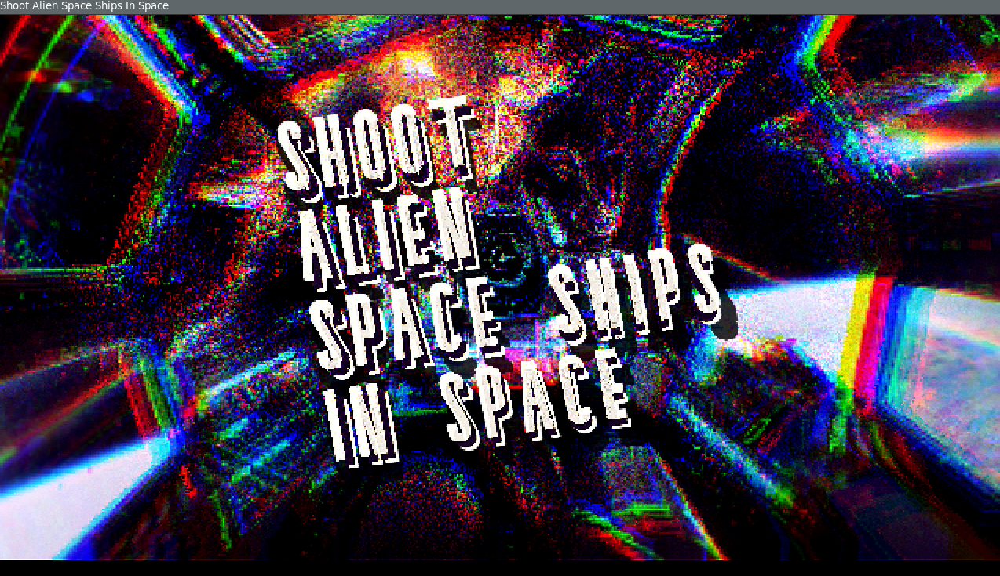
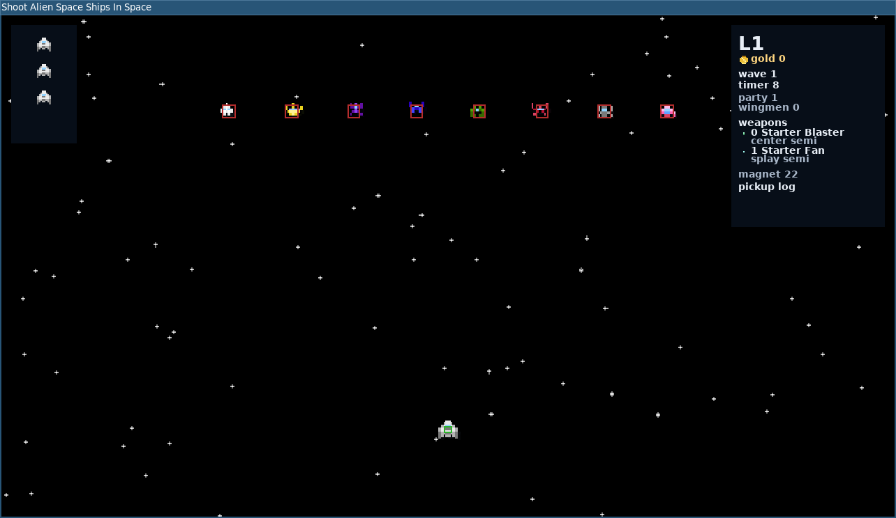

# ShootAlienSpaceShipsInSpace

Small C++/SDL reboot of the older Python prototype.

This version has moved well past a straight port. It now has:

- multi-wave levels and bosses
- a shop phase between levels
- stackable weapons and upgrades
- active weapon slots plus a stash
- inventory inspection
- several distinct weapon grammars, including missiles, rails, arcs, mines, bursts, beams, and orbitals

Wingmen are planned and documented, but not implemented yet.

## Build

VS Code:

`F5`

Shell:

`./scripts/build.sh`

Run:

`./scripts/run.sh`

## Design

The reboot plan is in [docs/design.md](/home/vega/Coding/GameDev/ShootAlienSpaceShipsInSpace/docs/design.md).

Progression / loot direction is in [docs/progression.md](/home/vega/Coding/GameDev/ShootAlienSpaceShipsInSpace/docs/progression.md).

## Screenshots

Title:

Level 1:

